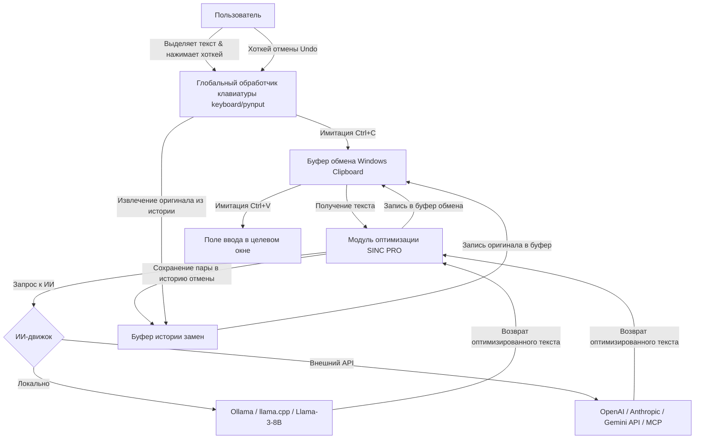

# Задел на будущее: ИИ-оптимизатор текста (Smart Text Optimizer & Prompt Generator)

Этот документ описывает концепцию, сценарии использования и техническую архитектуру будущей функции — **ИИ-оптимизатора текста**, интегрированного непосредственно в рабочую среду Windows через виджет SINC PRO.

---

## 1. Общее видение функции
Пользователь выделяет текст в любом приложении Windows (или надиктовывает его голосом) и нажимает глобальную комбинацию клавиш. Встроенный ИИ преобразует сумбурный, сырой или избыточный текст в логичный, структурированный, детализированный текст без "воды", сохраняя при этом все ключевые факты и смысл. Оптимизированный текст автоматически заменяет выделенный фрагмент в поле ввода, предоставляя возможность быстрого отката к оригиналу (Undo).

---

## 2. Сценарии использования (UX-дизайн)

### Сценарий A: Оптимизация выделенного текста (Хоткей)
1. Пользователь пишет черновик или сумбурные мысли в любом окне ввода (браузер, мессенджер, IDE, Word).
2. Выделяет этот текст и нажимает горячие клавиши (например, `Ctrl + Shift + Alt + O`).
3. Виджет перехватывает текст, отправляет его на обработку ИИ с анимацией загрузки на панели.
4. Текст в поле ввода автоматически заменяется на структурированный и отредактированный.
5. Если результат не устраивает, повторное нажатие хоткея (или специального сочетания для отмены, например `Ctrl + Shift + Alt + Z`) возвращает исходный текст.

### Сценарий B: Голосовое надиктовывание с оптимизацией
1. Пользователь ставит курсор в поле ввода, нажимает хоткей диктовки.
2. Проговаривает свои мысли голосом (потоковое распознавание речи, например, через локальный Whisper или API).
3. По окончании записи ИИ берет распознанную стенограмму, убирает слова-паразиты, структурирует её и вставляет готовый детализированный текст на место курсора.

---

## 3. Техническая архитектура



### 3.1. Глобальный перехват и замена текста
Для интеграции с любыми внешними окнами ввода в Windows используется подход на основе эмуляции системных событий:
1. **Чтение выделенного текста**:
   - Сохранение текущего содержимого буфера обмена пользователя.
   - Эмуляция нажатия `Ctrl + C` для копирования выделенного текста в буфер обмена.
   - Извлечение текста из буфера обмена в память Python.
   - Восстановление исходного буфера обмена, чтобы не затирать данные пользователя.
2. **Вставка оптимизированного текста**:
   - Помещение обработанного ИИ текста в буфер обмена.
   - Эмуляция нажатия `Ctrl + V` для замены выделенного текста.
   - Восстановление исходного содержимого буфера обмена.

### 3.2. Механизм Отмены (Undo/Redo)
В памяти приложения создается легковесный стек истории замен (хранящий пары: `ID целевого окна`, `оригинальный текст`, `оптимизированный текст`). 
При нажатии хоткея отмены:
1. Программа определяет активное окно через Win32 API (`GetForegroundWindow`).
2. Находит последнюю замену для этого окна.
3. Копирует оригинальный текст в буфер обмена.
4. Имитирует `Ctrl + V` для возврата исходного текста.

---

## 4. Движок искусственного интеллекта (ИИ)

Реализуется гибридная схема с возможностью выбора в настройках:

### Вариант 1: Локальный ИИ (Полная конфиденциальность, оффлайн)
- **Базовый инструмент**: [Ollama](https://ollama.com/) (работает как локальный сервис на ПК пользователя).
- **Рекомендуемые модели**: `Llama-3-8B-Lexi-v0.2` (отлично оптимизирована для русского языка), `Gemma-2-9B-it`, `Phi-3-medium`.
- **Взаимодействие**: SINC PRO отправляет локальный POST-запрос на `http://localhost:11434/api/generate`.

### Вариант 2: Внешний API (Высокое качество, без нагрузки на ПК)
- **Модели**: `GPT-4o-mini`, `Claude 3.5 Sonnet`, `Gemini 1.5 Flash`.
- **Взаимодействие**: Прямые HTTPS-запросы к API провайдеров или через интеграцию с Model Context Protocol (MCP) серверами.

---

## 5. Системный промпт (Prompt Engineering)

Для качественного преобразования сумбурного текста используется специализированный системный промпт:

```text
Ты — профессиональный ИИ-оптимизатор текста и генератор промптов.
Твоя задача — взять сырой, сумбурный, записанный на слух или скопированный текст пользователя и превратить его в логичный, структурированный, лаконичный и детализированный текст профессионального качества.

Правила обработки:
1. Полностью удали "воду", слова-паразиты, повторения и сумбурные речевые обороты.
2. Сохрани ВСЕ ключевые детали, факты, названия, цифры, термины и смысл исходного сообщения. Ничего не придумывай от себя и не теряй важную информацию.
3. Сделай текст логически последовательным. Используй списки и абзацы, если это уместно для улучшения читаемости.
4. Пиши в нейтрально-деловом или профессиональном стиле, подходящем для рабочих чатов, писем или технических заданий.
5. Не добавляй никаких мета-комментариев от себя (например, "Вот ваш текст:"), возвращай ТОЛЬКО очищенный оптимизированный текст.
```

---

## 6. Дорожная карта интеграции (Roadmap)
1. **Этап 1**: Разработка модуля глобального перехвата выделенного текста через `pykeyboard` / `win32gui` и работы с буфером обмена.
2. **Этап 2**: Реализация менеджера истории замен (Undo/Redo) для восстановления оригинального текста по хоткею.
3. **Этап 3**: Настройка клиента для общения с локальным API Ollama и внешними API (OpenAI/Gemini). Создание вкладки настроек "ИИ-оптимизатор" в виджете.
4. **Этап 4**: Добавление модуля голосового ввода (Whisper) для диктовки с последующей ИИ-обработкой.
